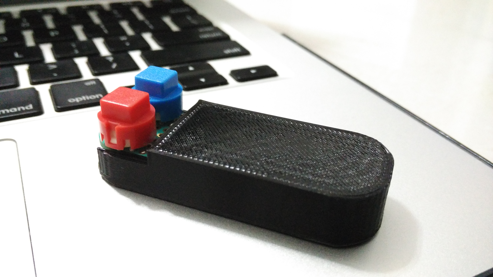

## bean-clicker

The primary motivation is the daunting high prices of commercial presenter tool available in the market. It is something that we do not use as often as our phones but one that is valuable during a presentation.

This was used to deliver my talk at [GeekcampSG 2015!](http://www.geekcamp.sg/) and it worked brilliantly.

### Setup required

- [LightBlue-Bean](https://punchthrough.com/bean-teaser)
- [Bean loader app](http://legacy.punchthrough.com/bean) --> look under install guides
- [nodejs](https://nodejs.org/en/) v0.10.x or v0.12.x recommended

### Hardware wiring

All i did was to add 2 x buttons on the prototyping space and wire them up to pins D0 and D5. The button is wired up to +3V3 on one side and to the input pin on the other while having the pin configured as `INPUT_PULLUP`.

You may ask why I used an Active Low button setup: "Somehow with your fingers near the board, you can trigger a HIGH signal..."

### How to get started
- Download this repo (click the download as zip)
- `cd` into the directory containing the files
- `mkdir node_modules`
- `npm install`
- run the bean loader, right-click to connect the bean followed by "Use for Virtual Serial"
- `npm start` and you should see `Serial Port Opened`

### Software explanation

The **bean** will send "r" and "l" and interpreted by the nodejs app to send a "right" or "left" keyboard keystroke accordingly!

Tried using the `pinChangeInt` library but it's not 100% reliable. This would have allowed the device to be in low power mode always but somehow failed to work. Also have some issues attaching interrupt to 2 pins so shelving this idea for now.

The eventual approach is to check that the nodejs App responds with a data or keep re-sending the command every 100ms for 10 attempts before giving up.

~kennethlimcp

Updated on: 27 Sept 2015
